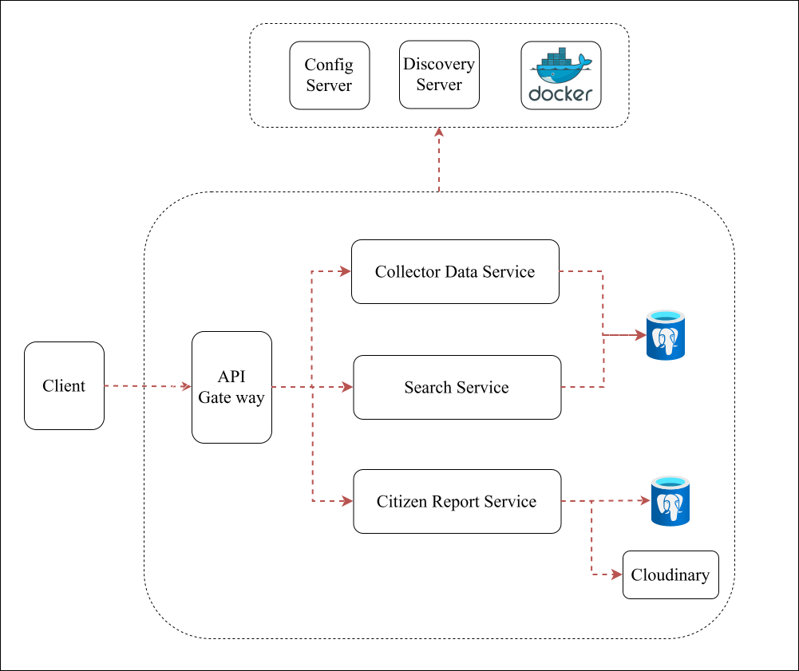

# 🌿 DaNang EcoWarning


> Hệ thống phân tích, trực quan hóa dữ liệu môi trường và cảnh báo sớm thiên tai tại Đà Nẵng.

---

## 📖 Mục lục

- [Giới thiệu](#-giới-thiệu)
- [Tài liệu phân tích nghiệp vụ](#-tài-liệu-phân-tích-nghiệp-vụ-ba-documents)
- [Tính năng](#-tính-năng)
- [Công nghệ sử dụng](#️-công-nghệ-sử-dụng)
- [Kiến trúc hệ thống](#-kiến-trúc-hệ-thống)
- [Hướng dẫn cài đặt](#-hướng-dẫn-cài-đặt)
- [Liên hệ](#-liên-hệ)

---

## 📍 Giới thiệu

**DaNang EcoWarning** là dự án cá nhân tập trung vào việc thu thập, phân tích và trực quan hóa dữ liệu môi trường tại thành phố Đà Nẵng. Hệ thống cung cấp dashboard tương tác giúp người dùng theo dõi tình hình thời tiết, khí hậu, nông nghiệp và nhận cảnh báo sớm về các rủi ro thiên tai.

### Mục tiêu chính

- 📈 **Phân tích dữ liệu môi trường** — Thu thập và xử lý dữ liệu thời tiết, khí hậu, nông nghiệp từ các nguồn dữ liệu mở.
- 🎯 **Đánh giá tác động** — Phân tích ảnh hưởng của biến đổi khí hậu đến sản xuất nông nghiệp và xác định các rủi ro thiên tai tiềm ẩn.
- 🗺️ **Tương tác cộng đồng** — Xây dựng dịch vụ cho phép người dùng báo cáo trực tiếp các sự cố (ngập lụt, sạt lở,...) để đóng góp vào bản đồ rủi ro cộng đồng.

---

## 📚 Tài liệu phân tích nghiệp vụ (BA Documents)

| Tài liệu | Nội dung |
| :--- | :--- |
| [SRS](./docs/01-SRS.md) | Mục tiêu nghiệp vụ & KPI, stakeholder, yêu cầu chức năng / phi chức năng, quy tắc nghiệp vụ, gap analysis |
| [User Stories & MoSCoW](./docs/02-user-stories.md) | User story, tiêu chí chấp nhận, độ ưu tiên, ma trận truy vết |
| [Use Case](./docs/03-use-cases.md) | Sơ đồ & đặc tả use case |
| [Quy trình nghiệp vụ](./docs/04-business-process.md) | Quy trình báo cáo sự cố as-is / to-be, vòng đời trạng thái, quy trình nạp dữ liệu |
| [ERD & Nguồn dữ liệu](./docs/05-data-model.md) | Mô hình dữ liệu, từ điển dữ liệu, 26 bộ dữ liệu mở |

---

## ✨ Tính năng

| Tính năng | Mô tả |
| :--- | :--- |
| 📊 **Trực quan hóa dữ liệu** | Dashboard hiển thị dữ liệu thời tiết, khí hậu và tình hình nông nghiệp tại Đà Nẵng |
| 🔬 **Phân tích tác động** | Phân tích ảnh hưởng của các yếu tố thời tiết đến sản xuất nông nghiệp |
| 🔔 **Cảnh báo thiên tai** | Cảnh báo sớm về các rủi ro thiên tai tiềm ẩn (bão, lũ, sạt lở) |
| 👥 **Báo cáo cộng đồng** | Người dùng gửi báo cáo sự cố thiên tai, đánh dấu trên bản đồ rủi ro |

---

## 🏗️ Công nghệ sử dụng

### 🖥️ Front-end

| Công nghệ | Vai trò |
| :--- | :--- |
| [React (JSX)](https://react.dev/) | Thư viện JavaScript xây dựng giao diện |
| [Vite](https://vitejs.dev/) | Công cụ build & dev server |
| [SASS (SCSS)](https://sass-lang.com/) | Tiền xử lý CSS |
| [Recharts](https://recharts.org/) | Thư viện vẽ biểu đồ |
| [GoongJS](https://docs.goong.io/) | Thư viện bản đồ |
| [React Router](https://reactrouter.com/) | Điều hướng trang |
| [Axios](https://axios-http.com/) | HTTP Client gọi API |
| [React Icons](https://react-icons.github.io/react-icons/) | Bộ icon |

### 🗄️ Back-end (Microservices)

| Công nghệ | Vai trò |
| :--- | :--- |
| [Spring Boot](https://spring.io/projects/spring-boot) | Framework xây dựng API |
| [Spring Data JPA](https://spring.io/projects/spring-data-jpa) | ORM truy cập cơ sở dữ liệu |
| [PostgreSQL](https://www.postgresql.org) | Cơ sở dữ liệu quan hệ |
| [Cloudinary](https://cloudinary.com/) | Lưu trữ & phân phối hình ảnh |
| [Docker & Docker Compose](https://www.docker.com/) | Containerize & quản lý services |
| [Swagger (SpringDoc)](https://springdoc.org) | Tài liệu API tự động |
| [Apache Commons CSV](https://commons.apache.org/proper/commons-csv) | Đọc & phân tích file CSV |

---

## 🔧 Kiến trúc hệ thống



---

## 🚀 Hướng dẫn cài đặt

### 📋 Yêu cầu

- [Docker](https://docs.docker.com/get-started/get-docker/)
- [Docker Compose](https://docs.docker.com/compose/install/)
- [Node.js (v18+)](https://nodejs.org/)

### 1️⃣ Clone dự án

```bash
git clone https://github.com/dtam-L/DaNang_EcoWarning.git
cd DaNang_EcoWarning
```

### 2️⃣ Chạy Back-end

**Cấu hình biến môi trường:**

1. Vào thư mục `backend`, tìm file `.env.example`.
2. Tạo bản sao và đổi tên thành `.env`.
3. Điền các giá trị cần thiết (`POSTGRES_PASSWORD`, `CLOUDINARY_API_SECRET`,...).

**Khởi chạy services:**

```bash
cd backend
docker-compose up -d
```

**Port Binding:**

| Service | Port |
| :--- | :--- |
| API Gateway | `8080` |
| Config Server | `8888` |
| Discovery Server | `8761` |
| Collector Data Service | `8081` |
| Search Service | `8082` |
| Citizen Report Service | `8083` |

### 3️⃣ Chạy Front-end

```bash
cd frontend/Danang_EcoWarning_FE
npm install
npm run dev
```

Web app sẽ chạy tại **http://localhost:5173**.

**Production build (tùy chọn):**

```bash
npm run build
npm run preview
```

Web app production chạy tại **http://localhost:4173**.

---

## 📫 Liên hệ

- **Tác giả:** Đặng Văn Tâm
- **GitHub:** [dtam-L](https://github.com/dtam-L)

---

