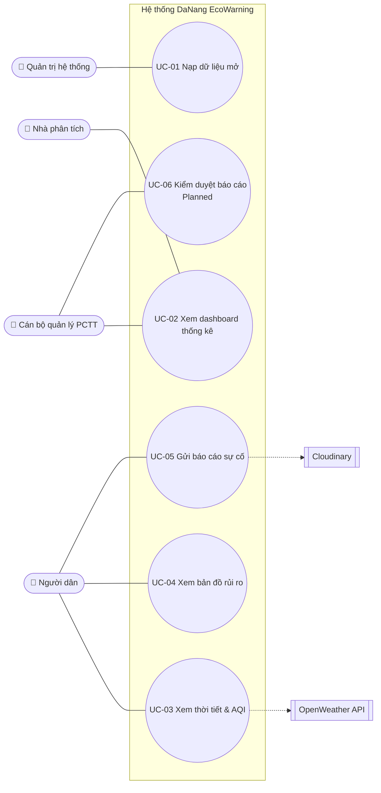

# Use Case — DaNang EcoWarning

## 1. Sơ đồ Use Case

## 2. Đặc tả Use Case

### UC-05 — Gửi báo cáo sự cố
| Mục | Nội dung |
|-----|----------|
| Actor chính | Người dân |
| Hệ thống liên quan | Cloudinary (lưu ảnh) |
| Mục tiêu | Ghi nhận sự cố tại hiện trường có cấu trúc để cơ quan quản lý xử lý |
| Tiền điều kiện | Người dân truy cập trang Báo cáo |
| Hậu điều kiện (thành công) | Báo cáo được lưu với trạng thái PENDING, ảnh (nếu có) được lưu trữ |
| Quy tắc | BR-01 – BR-08 |

**Luồng chính**
1. Người dân mở trang Báo cáo sự cố.
2. Hệ thống hiển thị form với loại mặc định "Ngập lụt" và vị trí mặc định ở trung tâm Đà Nẵng.
3. Người dân chọn loại sự cố (1 trong 11 loại).
4. Hệ thống hiển thị các trường chi tiết tương ứng với loại sự cố (BR-08).
5. Người dân chọn vị trí trên bản đồ, nhập địa chỉ, mô tả, thông tin chi tiết và (tùy chọn) đính kèm ảnh.
6. Người dân bấm **Gửi**.
7. Hệ thống kiểm tra tọa độ (BR-01), ảnh (BR-06), loại sự cố (BR-02), thời gian (BR-03, BR-04), mô tả (BR-05).
8. Hệ thống lưu ảnh, tạo báo cáo với trạng thái PENDING.
9. Hệ thống thông báo gửi thành công và làm mới form.

**Luồng thay thế / ngoại lệ**
- **7a.** Tọa độ trống hoặc ngoài Đà Nẵng → báo lỗi, quay lại bước 5.
- **7b.** Ảnh > 5 MB hoặc sai định dạng → báo lỗi, quay lại bước 5.
- **7c.** Loại sự cố không thuộc danh mục → báo lỗi.
- **7d.** Thời điểm sự cố cũ hơn 7 ngày, hoặc kết thúc không sau bắt đầu → báo lỗi.
- **8a.** Lưu ảnh thất bại → báo "Gửi báo cáo thất bại. Vui lòng thử lại.", không lưu báo cáo.

### UC-04 — Xem bản đồ rủi ro
| Mục | Nội dung |
|-----|----------|
| Actor chính | Người dân |
| Mục tiêu | Biết vị trí hạ tầng phòng chống thiên tai và khu vực nguy cơ |
| Hậu điều kiện | Người dùng xem được hồ sơ địa điểm |

**Luồng chính**
1. Người dùng mở trang Bản đồ.
2. Hệ thống hiển thị 6 loại địa điểm kèm tỷ lệ %.
3. Người dùng chọn một loại (ví dụ: Nhà trú bão).
4. Hệ thống hiển thị marker các địa điểm thuộc loại đó.
5. Người dùng click một marker.
6. Hệ thống mở panel hồ sơ: thông tin chung (tên, quận/huyện, phường/xã, địa chỉ, thuộc tính) và dữ liệu mới nhất.
7. Người dùng đóng panel.

**Luồng thay thế**
- **3a.** Người dùng nhập ≥ 2 ký tự vào ô tìm kiếm → hệ thống gợi ý sông / hồ theo tên → người dùng chọn kết quả → tiếp tục bước 6.

### UC-02 — Xem dashboard thống kê
| Mục | Nội dung |
|-----|----------|
| Actor chính | Cán bộ quản lý, Nhà phân tích |
| Mục tiêu | Phân tích thiệt hại thiên tai và tình hình nông nghiệp, thời tiết |

**Luồng chính**
1. Người dùng mở Dashboard.
2. Hệ thống hiển thị biểu đồ chỉ số (mặc định nhóm Nông nghiệp), biểu đồ thiệt hại theo năm và panel tổng cộng thiệt hại.
3. Người dùng đổi nhóm / chỉ số → biểu đồ cập nhật.
4. Người dùng click cột một năm → panel hiển thị chi tiết năm đó.
5. Người dùng click một hạng mục thiệt hại → popup lịch sử hạng mục.

### UC-03 — Xem thời tiết & chất lượng không khí
1. Người dùng mở trang Thời tiết.
2. Hệ thống lấy thời tiết hiện tại, dự báo và AQI tại Đà Nẵng từ OpenWeather.
3. Hệ thống hiển thị thẻ thời tiết hiện tại, dự báo theo giờ & 5 ngày, biểu đồ nhiệt độ – độ ẩm – lượng mưa, thẻ AQI.
- **2a.** Không lấy được dữ liệu → hiển thị "Không thể tải dữ liệu. Vui lòng thử lại."

### UC-01 — Nạp dữ liệu mở
1. Khi hệ thống khởi động, kiểm tra CSDL đã có dữ liệu chưa (BR-09). Nếu có → dừng.
2. Tạo mã lần chạy (runId).
3. Nạp lần lượt các file địa điểm (hồ, sông, khu sạt lở, trạm cảnh báo, nhà trú bão…).
4. Nạp các file số liệu (thời tiết, mực nước, môi trường, thiệt hại, nông nghiệp).
5. Với mỗi file, ghi nhật ký: thời gian, trạng thái, số bản ghi xử lý / thêm mới, lỗi.
- **3a/4a.** Bản ghi lỗi định dạng → ghi log, bỏ qua, tiếp tục bản ghi tiếp theo.

### UC-06 — Kiểm duyệt báo cáo *(Planned)*
1. Cán bộ mở danh sách báo cáo PENDING.
2. Cán bộ xem chi tiết (vị trí, ảnh, mô tả, thông tin chi tiết).
3. Cán bộ chọn **Xác minh** → trạng thái VERIFIED, báo cáo được hiển thị trên bản đồ cộng đồng.
- **3a.** Cán bộ chọn **Từ chối** và nhập lý do → trạng thái REJECTED.
