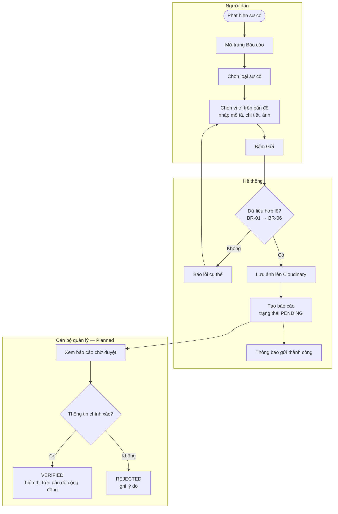
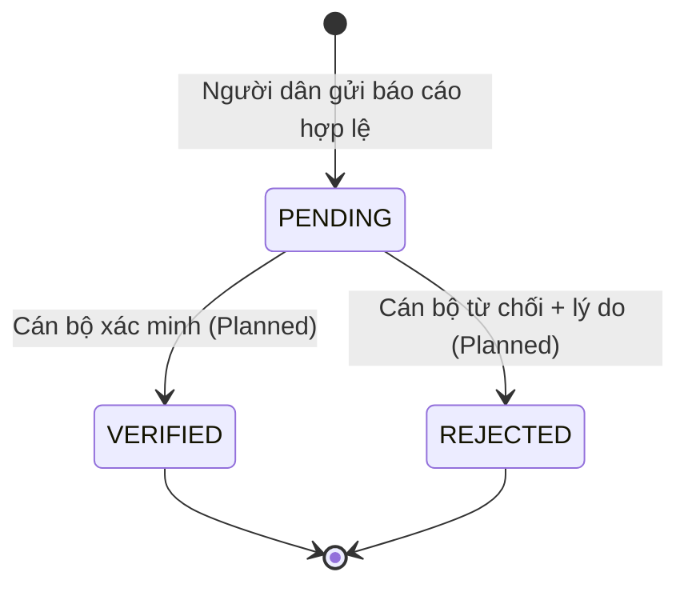
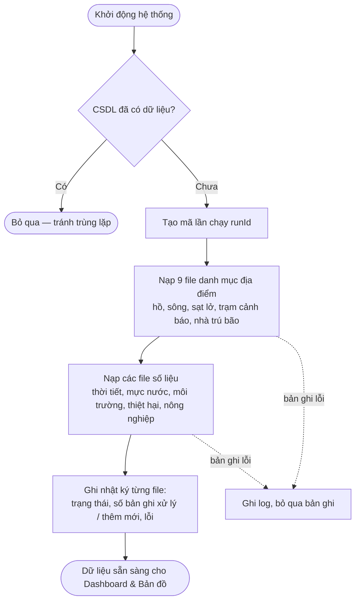

# Quy trình nghiệp vụ — DaNang EcoWarning

## 1. Quy trình báo cáo sự cố

### 1.1 As-is (khi chưa có hệ thống)
- Người dân báo sự cố qua điện thoại, mạng xã hội hoặc báo trực tiếp cho chính quyền địa phương.
- Thông tin **không có cấu trúc** (thiếu tọa độ, thiếu ảnh, mô tả tự do), khó tổng hợp và dễ trùng lặp.
- Cơ quan quản lý mất thời gian xác minh vị trí và mức độ sự cố.

### 1.2 To-be (với DaNang EcoWarning)

**Giá trị mang lại:** báo cáo luôn có tọa độ trong Đà Nẵng, loại sự cố chuẩn hóa, có ảnh hiện trường và trạng thái xử lý rõ ràng. Nhờ đó cơ quan quản lý xác minh và tổng hợp nhanh hơn.

## 2. Vòng đời trạng thái báo cáo

| Trạng thái | Ý nghĩa | Ai được chuyển |
|-----------|---------|---------------|
| PENDING | Mới gửi, chờ xác minh | Hệ thống (tự động khi tạo) |
| VERIFIED | Đã xác minh là chính xác | Cán bộ quản lý |
| REJECTED | Sai / trùng / spam | Cán bộ quản lý |

## 3. Quy trình nạp dữ liệu mở

## 4. Hành trình người dùng (User Journey) — mùa mưa bão

| Bước | Người dân làm gì | Màn hình hỗ trợ |
|------|------------------|-----------------|
| 1 | Kiểm tra dự báo mưa, gió 5 ngày tới | Thời tiết |
| 2 | Tìm nhà trú bão gần nhà, xem khu vực từng sạt lở | Bản đồ rủi ro |
| 3 | Phát hiện đường ngập / cây đổ → báo cáo kèm ảnh | Báo cáo sự cố |
| 4 | *(Planned)* Xem các sự cố đã xác minh xung quanh | Bản đồ rủi ro |
