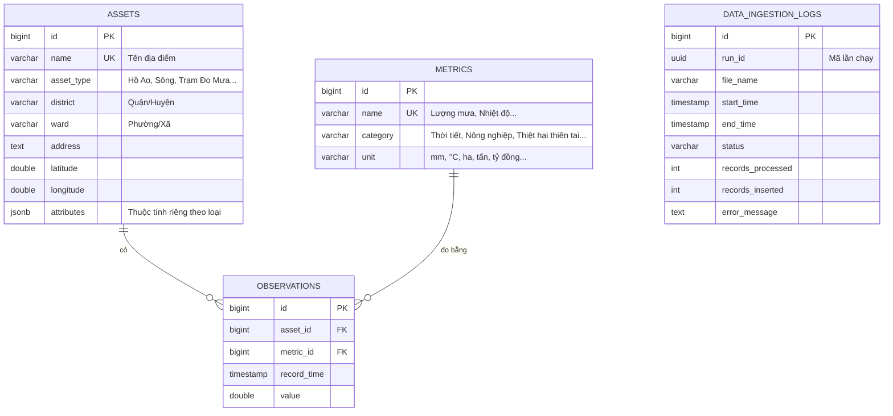
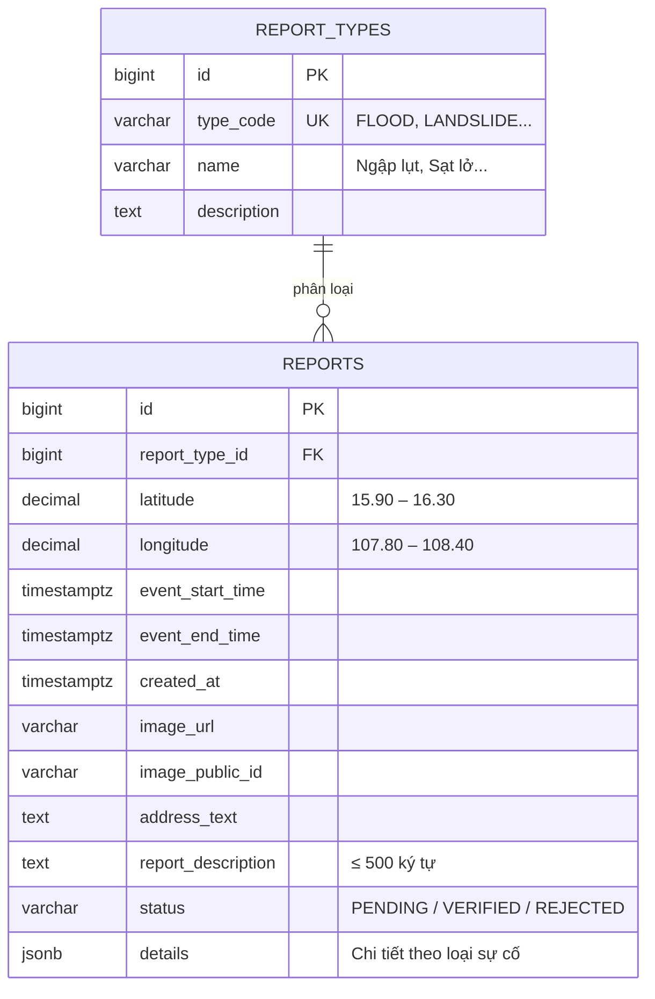

# Mô hình dữ liệu (ERD) & Nguồn dữ liệu — DaNang EcoWarning

Hệ thống dùng PostgreSQL với 2 cơ sở dữ liệu:
- `collector_data_service`: dữ liệu môi trường, dùng chung cho module Nạp dữ liệu và Tra cứu.
- `citizen_report_service`: dữ liệu báo cáo sự cố.

## 1. ERD — Dữ liệu môi trường

Dữ liệu từ nhiều file CSV khác nhau được chuẩn hóa về một mô hình chung **Asset – Metric – Observation**. Nhờ vậy có thể bổ sung nguồn dữ liệu mới mà không phải thay đổi cấu trúc bảng.

**Ví dụ:** "Lượng mưa tháng 10/2023 tại Đà Nẵng = 1.200 mm" (số liệu minh họa) được lưu thành `Asset = Đà Nẵng (Hành chính)`, `Metric = Lượng mưa (Thời tiết, mm)`, `Observation = (2023-10, 1200)`.

## 2. ERD — Báo cáo sự cố

### Danh mục loại sự cố (11 loại, 4 nhóm)
| Nhóm | Mã | Tên | Trường chi tiết (`details`) |
|------|----|-----|------------------------------|
| Thời tiết | STORM | Bão / Áp thấp | — |
| Thời tiết | HIGH_WIND | Lốc xoáy / Gió giật | — |
| Thời tiết | LIGHTNING | Sét | — |
| Nước | FLOOD | Ngập lụt | `estimatedDepthCm`, `floodType` (street/home) |
| Nước | FLASH_FLOOD | Lũ quét | — |
| Nước | LANDSLIDE | Sạt lở | — |
| Cháy | FOREST_FIRE | Cháy rừng | `isNearResidential` |
| Cháy | URBAN_FIRE | Cháy nổ (KDC/Công nghiệp) | — |
| Hạ tầng | FALLEN_TREE | Cây ngã / đổ | `isBlockingRoad` |
| Hạ tầng | POWER_LINE_DOWN | Đứt dây điện | — |
| Hạ tầng | SEVERE_TRAFFIC_JAM | Kẹt xe nghiêm trọng | `cause`, `estimatedLengthKm` |

## 3. Danh mục nguồn dữ liệu mở (26 bộ, 4 lĩnh vực)

| Lĩnh vực | # | Bộ dữ liệu | Nạp thành |
|----------|---|-----------|-----------|
| **Môi trường & Thủy văn** (10) | 1 | Danh mục các hồ ao | Asset: Hồ Ao |
| | 2 | Danh mục các hồ thủy lợi | Asset: Hồ Thủy Lợi |
| | 3 | Danh mục sông nội tỉnh | Asset: Sông / Suối |
| | 4 | Độ ẩm không khí trung bình | Metric: Thời tiết |
| | 5 | Lượng mưa | Metric: Thời tiết |
| | 6 | Nhiệt độ không khí trung bình | Metric: Thời tiết |
| | 7 | Số giờ nắng | Metric: Thời tiết |
| | 8 | Mực nước một số sông chính | Observation theo sông |
| | 9 | Lượng mưa thay đổi qua từng năm | Observation theo năm |
| | 10 | Một số chỉ tiêu thống kê về môi trường | Metric: Môi trường |
| **Nông nghiệp** (9) | 11 | Diện tích hiện có cây lâu năm | Metric: Nông nghiệp |
| | 12 | Sản phẩm và sản lượng cây lâu năm | Metric: Nông nghiệp |
| | 13–15 | Sản xuất cây hằng năm 2022, 2023, 2024 | Metric: Nông nghiệp |
| | 16–18 | Sản xuất cây lâu năm chủ yếu 2022, 2023, 2024 | Metric: Nông nghiệp |
| | 19 | Sản xuất nông nghiệp tính đến 20/9/2025 | Metric: Nông nghiệp |
| **Phòng chống thiên tai** (5) | 20 | Tháp cảnh báo ngập | Asset: Tháp Cảnh Báo Ngập |
| | 21 | Trạm cảnh báo lũ tự động | Asset: Trạm Cảnh Báo Lũ |
| | 22 | Trạm đo mưa tự động | Asset: Trạm Đo Mưa |
| | 23 | Nhà trú bão | Asset: Nhà Trú Bão |
| | 24 | Trạm trực canh cảnh báo thiên tai đa mục tiêu ven biển | Asset: Trạm Cảnh Báo Ven Biển |
| **Thiên tai** (2) | 25 | Các khu vực đã xảy ra sạt lở | Asset: Khu Vực Sạt Lở |
| | 26 | Thiệt hại do thiên tai | Metric: Thiệt hại thiên tai |

## 4. Vấn đề chất lượng dữ liệu đã xử lý
| Vấn đề | Cách xử lý |
|--------|-----------|
| Các file cùng loại nhưng khác thứ tự cột theo năm (ví dụ: file 2024 đảo cột "Tên" và "Phân loại") | Định nghĩa bộ header riêng cho từng năm |
| Cột năm dạng chữ ("Thực hiện năm 2023", "Ước tính năm 2024") | Tách năm từ tên cột, phân biệt số liệu thực hiện và ước tính |
| Giá trị số sai định dạng / trống | Ghi cảnh báo, bỏ qua giá trị, không dừng quá trình nạp |
| Sông và suối chung một file | Phân loại theo tên: tên chứa "suối" → loại Suối |
